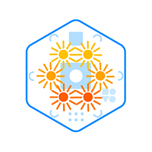
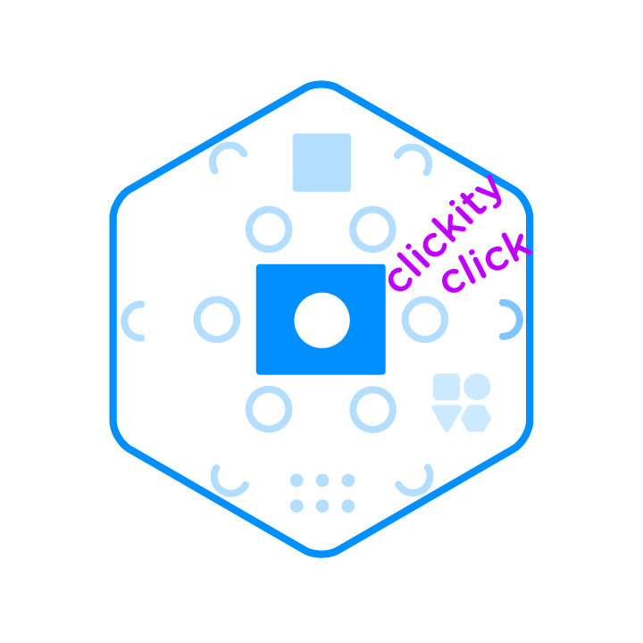

# Blinks Functionality Guide

## Overview

First of all, what are Blinks? Blinks is a digital/physical (“phygital”) tabletop game system that contains either six Blinks or twelve Blinks (the party pack). Each Blink is a "smart" hexagonal tile, designed to be held in the hand or placed next to other Blinks on a table. Magnets inside of each Blink allow the hexagonal tile to maintain an organized grid-like structure without needing a board. Each Blink has 3 key properties:

1. Blinks are ticklish (respond to touch)
2. Blinks are social (communicate with their neighbors)
3. Blinks love to play games (each one is responsible for remembering a single game, and can teach the others… more on game transmission later)

Let’s start with an understanding of the ins and outs of Blinks. If you want to jump right into the API, it is rather self explanatory, head here now.

## LEDs 
{:height="250px" width="250px"}

Blinks communicate to the players through RGB(red, green, blue… like a screen) illumination. You have full control over their hue, saturation, brightness, and can animate them in countless ways (i.e. pulsing, blinking, flashing...).  A diffuser makes Blinks look like an even glowing surface; however, there are 6 LEDs or pixels, one for each face of the hexagon. This allows for more complex animation and directionality, such as spinning, flowing from side to side, or counting up or down to name a few. 

While illumination is how a single Blink communicates to the players, the arrangement of the Blinks also communicates something to the players. In one example, the arrangement of 10 Blinks into different forms creates different behaviors of the whole. For example, if the Blinks are representing trees in a forest fire, a tightly packed set of 10 will spread the fire quicker than a long single file line of Blinks(trees). The player can reason this by seeing the arrangement of the board, and conversely, affect it by rearranging the board. Which brings me to inputs.

## Inputs
{:height="250px" width="250px"}

The simplest of inputs is a press. Each Blink responds to touch by pressing on a tactile button in the middle of the Blink (Blinks are seamless, so the entire top depresses). The button can be used in a variety of ways, and can respond to a quick click, a long press, a double click...

The button press can be an input to change the state of a Blink, or inform the Blink of a users action. For example, in the forest fire ruleset, a single press strikes lightning upon a Blink. If the Blink is a tree, it will then change state to be on fire, and if it is not a tree, it will simply go on being not a tree, as well as not on fire.

The press can also be used to reveal information contained in a Blink. For example, a Blink representing a place in a game of minesweeper could reveal that it has a mine under it only when held with a long press. The button press in this case didn't add information to the system but is simply used to reveal information.

## Communication 
{:height="250px" width="250px"}

The Blinks communicate with each of their six neighbors by receiving information ~20 times per second. The information passed is in the form of a single integer (0-63). If no Blink is present on a single side, the information expires. What does this mean in simple terms? This means that each Blink can tell each neighboring Blink that it is in one of roughly 64 states. In the forest fire example, there are 3 states: tree, fire, soil. But what about lightning? that isn't a state, since it only affects the local Blink, so it is animated through the illumination, but simply changes the Blink’s state from tree to fire.
Blinks are setup to do this kind of communication often and reliably, but it is not the only way they can communicate. For longer forms of information, such as passing string-like information, there is a shared data buffer that could be utilized. This is experimental and not refined in the API, so I recommend first trying to rely on simple communication with the dozen or so states afforded above.

## Time

Game time for the Blinks can be continuous, evaluating their state 20 times a second, or they can be discrete, evaluating their state only when a step is called. A step is a convenience function that allows all connected Blinks to understand that a step has happened. Think of it as a convenient way to let the entire connected board know that a single move has been made.

In the forest fire example, time is discrete, which makes the spread of the fire controlled by the rate of the steps. One could see this as a game mechanic, where each turn is a step forward.

In the game Fracture, a continuous game, Blinks are constantly evaluating their state so they can show players the most up to date representation of the current board state. This results in a board that is quickly responsive to arrangement, while discrete time makes a board that feels responsive to specific state changes or steps.

## Random vs. Deterministic

Blinks can respond to their inputs and neighbors deterministically, where they will respond exactly the same way given the same inputs and neighbors every time. This is the case in the example of Fracture or Game of Life. Players can learn how Blinks will behave given a certain arrangement because of this deterministic rule-set.

Games often use randomness for a bit of chance involved in each move. A dice roll, or a weighted random value can be very useful in creating suspense or capturing the real world uncertainty.

Randomness can also be used with Blinks with a bit of care and caution. In the example of the forest fire, each Blink (plot of land) has an n% chance of growing a tree. That percent increases with the number of neighboring trees, to represent fertile ground, but it is random none-the-less. The caviat with randomness and Blinks is that players must feel like Blinks are giving signal, not simply noise. If a player can't understand why a Blink is behaving in the way it is, it will be confusing for everyone. That said, it is not a technical limitation, if you want a Blink to be a random different color every time you press it, that is an easy program to write.

## Memory

While Blinks can maintain a bit of a memory or history of what they have done, neighbors they've had, or how much time has passed, this is limited and it is important to remember that if this isn't transparent to the player, it could be very confusing. I look forward to seeing elegant solutions in which a bit of [stygmergy](https://www.wikiwand.com/en/Stigmergy) might just seep its way into a game and shed light on a beautiful invisible system that lies just beneath the surface. (more on program space below)

## Trickery

As you might have noticed, you have complete control over the way a Blink displays itself to the player and the state a Blink is actually in. It might be useful to have many states an only 2 visibly different appearances to the players. Conversely, it might be useful to have only two states and show many different illuminations.

The possibilities are many, feel free to look through the examples, they aim to walk you through the basics, and we welcome contributions for more.

Please feel free to ask about features, and if I didn't cover something that is in the API, I should, so point it out, it belongs here, too!

## API
  - Check out the glossary [here](glossary.md)
  - Slightly more verbose version [here](api.md)
  - Full API [here](https://github.com/Move38/Move38-Arduino-Platform)

## Nerdy Details

Each Blink has 16KB of RAM. For not having a screen, this is more than sufficient. In fact, we recommend keeping games under 4KB, so that we can transmit them from Blink to Blink in an efficient manner. The [full code-base](https://github.com/Move38/Move38-Arduino-Platform) is published on GitHub where master contains our latest robust release and dev contains in progress features (such as an animation library).
