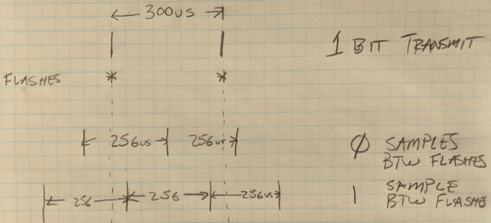

# Constraints

We detect incoming light by charging the IR LEDs up and then waiting for them to discharge below the digital `1` threshold. The more light falling on the LED, the more quickly it discharges. See `core/ir.md` for details.

Empirically the IR LEDs take longer than 1ms to discharge in ambient light, but on the order of a few us when directly illuminated by an IR LED on a nearby tile.

To cause the receiver to discharge, the sender transmits a short flash. These are on the order of a few us long.  

# THEORY OF OPERATION

A bit is represented by the space between two pulses of light. A short space is a '1' and a long space is a '0'.

The long space must be shorter than 1ms to ensure that ambient light can not generate valid bits. Anytime we see a space longer than a long space we know the trigger was cause by ambient light rather than an actual transmsion, so we can ignore the bit and escape out of any reception in progress.  

A transmission is sent as a series of 8 bits. 

## Timing

Since blinks use the cheap internal RC clock on the ATMEGA, we must be able to tolerate time bases that may be off by up to 10% between sender and receiver.

We do this by carefully picking timing windows to send and detect flashes.

The amount of time between consecutive flashes represents the bits as follows...

| Bit | Time | 
|-|-|
| 0 | 150us |
| 1 | 600us |

The receiver periodically samples the IR LEDs to see if a flash (or ambient discharge) has occurred since the last sample.  If the LED has been discharged then it is recharged at this time. 

The sampling takes place every 256us. After each sample, we keep track of how many samples it has been since the last time we saw a discharge on each LED.

If it has been 4 or more samples, that means that is has been more than 1024us since the last discharge. Since the longest time that can happen between two flashes is 990us (900us + 10% clock difference), this means that the most recent trigger is not a valid bit.

Because the transmit and receive clocks are asynchronous and possibly up to 10% off, there are several ways a transmitted bit can appear to the sampling receiver...

| Samples between triggers | Transmitted bit |
|-|-|
| 0 | 1 |
| 1 | 1 |
| 2 | 0 |
| 3 | 0 |
| 4+ | Invalid |

If it has been 0 or 1 samples since the last trigger, this corresponds to a valid transmitted `1` bit.

(note that the speed has been doubled since these drawings were made, so all absolute time periods are half as long!) 

If it has been 2 or 3 samples since the last trigger, this corresponds to a valid transmitted `0` bit.

## Preamble
        
We always send a preamble of "110" before the data bits. This allows the receiver to detect the 
incoming byte. This sequence is special.

Because we always clear the buffer to zeros whenever we see an invalid bit, the only way a '1' can end up in the top bit of the buffer is if we have received 8 consecutive valid bits. This saves us needing a separate bit counter - the leading `1` gets shifted up the buffer naturally as each new valid it is received. 

The following '0' guards against the case where we send an opening '1' bit but it just happens to come right after the LED had spontaneously triggered. In this case, we might see these two fires (the spontaneous one and the intentional start of the preamble one) as a valid '1' bit. The extra '0' ensures that only the second intentional '1' bit will have a '0' after it and the phantom '1' will be pushed off the top of the buffer. 

## Data

There are 6 data bits after the preamble. MSB sent first. 

There should be an idle gap after the end of each transmission for synchronization. If we sent a continuous string of valid bits, it is possible that the "10" preamble pattern could appear in the data and prevent the receiver from syncing to the correct start of each byte. Having a gap between bytes ensure that no matter when the receiver starts receiving, it will only ever see valid full bytes.

# Implementation     
    
Internally, we use an 8-bit buffer to store incoming bits. This is space efficient and allows us to accumulate newly received bits at a cost of only a left shift followed an OR. 

To check to see if a full valid byte has been received, we look at the top two bits of the buffer match the '10' preamble sequence to know if we have received a good transmission. This costs an AND followed by a compare. 

If we ever go too long between pulses, we reset the incoming buffer to '0' to avoid detecting a phantom message. 
